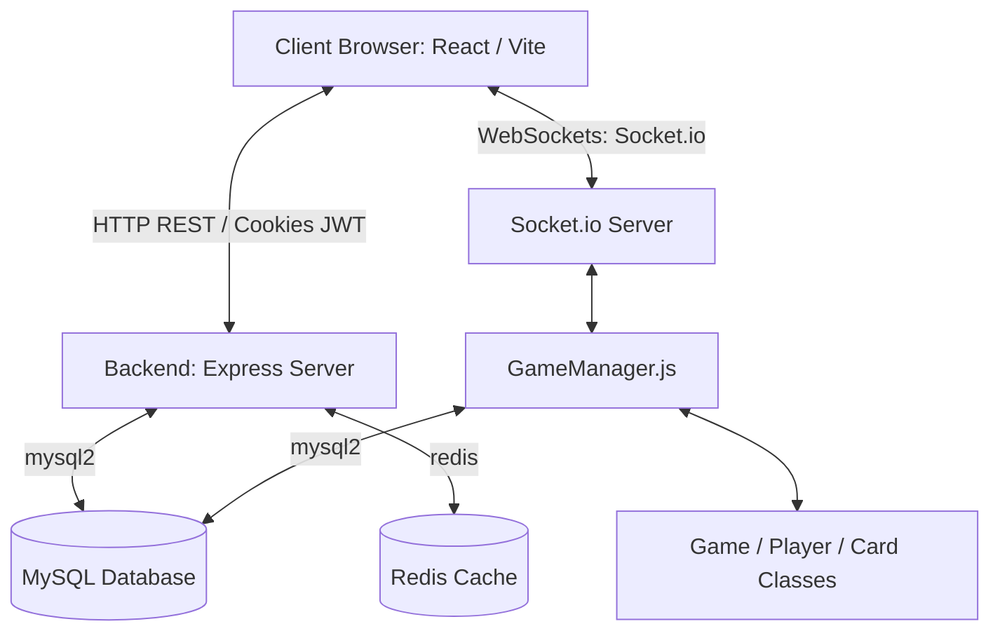
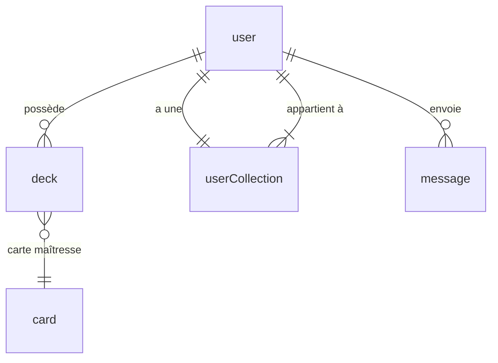

# 📁 Documentation Technique : Architecture de Twisted Realms

Cette documentation présente une vue d'ensemble détaillée de l'architecture technique du projet **Twisted Realms**, un jeu de cartes à collectionner (TCG) multijoueur en temps réel jouable sur navigateur.

---

## 🧭 1. Vue d'ensemble de l'Architecture

Le projet repose sur une architecture découplée de type **Client-Serveur** moderne :
- **Frontend** : Application Single Page (SPA) développée avec **React** et **Vite**, communiquant avec le serveur via des requêtes HTTP (API REST) et des **WebSockets** (Socket.io-client) pour le temps réel.
- **Backend** : Serveur HTTP et WebSocket propulsé par **Node.js** avec **Express** et **Socket.io**.
- **Base de Données** : Base relationnelle **MySQL** pour les données persistantes et intégration de **Redis** pour la gestion de cache ou d'états de session rapides.

---

## 💻 2. Frontend (`/client`)

Le frontend est structuré pour maximiser la réactivité et offrir une interface immersive stylisée en **CSS3 Vanilla** (sans framework CSS, pour un contrôle total sur l'esthétique et les animations du jeu).

### 🛠️ Fiche Technique
- **Framework** : React 18+ (avec Vite comme outil d'assemblage)
- **Routage** : React Router Dom v7
- **Communication Temps Réel** : `socket.io-client`
- **Proxying** : Vite redirige les requêtes `/api` vers le backend local `http://localhost:5000` via [vite.config.js](./client/vite.config.js).

### 📁 Structure des Répertoires
- `src/main.jsx` : Point d'entrée de l'application React.
- `src/App.jsx` : Composant racine gérant la session utilisateur courante (`fetchUser`) et le routage de l'application.
- `src/index.css` : Styles globaux et variables de thème (palette violet/noir, polices, etc.).
- `src/views/` : Composants de page complets (les vues principales).
- `src/components/` : Éléments d'interface réutilisables.

### 📄 Vues Principales (`src/views/`)
- [Home.jsx](./client/src/views/Home.jsx) : Page d'accueil intégrant les actualités, les règles du jeu et la barre latérale du **Chat Global**.
- [Login.jsx](./client/src/views/Login.jsx) & [Register.jsx](./client/src/views/Register.jsx) : Formulaires d'inscription et de connexion.
- [Profile.jsx](./client/src/views/Profile.jsx) : Affichage des statistiques utilisateur, modification des informations de sécurité et téléversement de l'avatar (géré via `multer` côté serveur).
- [Shop.jsx](./client/src/views/Shop.jsx) : Boutique permettant de dépenser des crédits gagnés en jeu pour acheter des _Boosters_ de faction ou des _Structure Decks_.
- [Collection.jsx](./client/src/views/Collection.jsx) : Visualisation des cartes possédées avec filtres avancés (factions, coût, type) et sélection de cartes favorites.
- [Decks.jsx](./client/src/views/Decks.jsx) : Éditeur de decks permettant de composer des listes de 30 cartes et de désigner la carte maîtresse du deck (master card).
- [Lobby.jsx](./client/src/views/Lobby.jsx) & [GameLobby.jsx](./client/src/views/GameLobby.jsx) : Salons d'attente permettant de rejoindre ou d'héberger des parties, et de discuter avant le lancement.
- [Game.jsx](./client/src/views/Game.jsx) : Conteneur principal de l'arène de combat.

### 🧩 Composants Clés (`src/components/`)
- [GameTable.jsx](./client/src/components/GameTable.jsx) : **Le cœur du plateau de jeu.** Gère le rendu visuel de la main du joueur, de la zone de combat (5 emplacements pour les _Êtres_), de la zone de soutien (3 emplacements pour les _Sorts_ / _Soutiens_), du cimetière, de l'ostrac (bannissement), des compteurs d'énergie (Accélérateurs) et des PV de chaque duelliste.
- [Card.jsx](./client/src/components/Card.jsx) : Composant de rendu de carte s'adaptant selon le contexte (miniature pour le deck builder ou vue complète avec illustrations, factions, points d'ATK et PV).
- [GlobalChat.jsx](./client/src/components/GlobalChat.jsx) : Module de discussion en temps réel partagé à travers l'application via WebSockets.

---

## ⚙️ 3. Backend (`/server`)

Le serveur est conçu de façon modulaire avec une architecture inspirée de la séparation des responsabilités (**MVC / Services**), couplée à un moteur d'état en mémoire pour les parties de cartes actives.

### 📁 Structure des Répertoires
Le serveur est divisé en plusieurs répertoires spécialisés :
- `db/` : Fichiers de configuration des connexions à la base de données.
- `router/` : Définition des routes Express (endpoints HTTP).
- `controller/` : Réception des requêtes HTTP, extraction des paramètres et appel des services ou modèles associés.
- `model/` : Abstraction de la base de données (requêtes MySQL SQL directes).
- `service/` : Logique métier de l'application (ex. traitement de l'achat d'un booster).
- `script/` : Logique complexe et états du jeu de cartes en temps réel.
- `middleware/` : Middlewares Express (authentification JWT, gestion de téléversement d'images).

### 🔀 Les Routes & Contrôleurs HTTP
Le backend expose des API REST préfixées sous :
1. `/user` : Inscription, authentification (JWT), mise à jour d'avatar (`multer`), récupération des informations de profil et des decks associés.
2. `/card` : Récupération du catalogue de cartes globales.
3. `/shop` : Achat de paquets de cartes, déduction des crédits utilisateur et ajout à la collection.
4. `/game` : Création et récupération des salons de jeu (lobbies).
5. `/message` : Récupération de l'historique des messages du chat global.

---

## 🎮 4. Moteur de Jeu Temps Réel (`server/script`)

Contrairement aux opérations CRUD standards enregistrées directement en base de données, la logique de combat en temps réel est pilotée par un moteur de jeu orienté objet en mémoire.

### 🕹️ Le GameManager (`script/GameManager.js`)
[GameManager.js](./server/script/GameManager.js) gère l'ensemble des sessions de duel actives. 
- Il instancie un nouvel objet de jeu lors du lancement.
- Il intercepte les requêtes de Socket.io et redirige l'action vers la bonne instance de jeu après avoir vérifié que c'est le tour du joueur concerné.
- Il met à jour l'état persistant du jeu en base de données à chaque action utilisateur pour éviter toute perte de progression en cas de coupure réseau.
- Il gère la fin de partie (mise à jour des crédits du gagnant/perdant et libération de la mémoire RAM en supprimant la partie de son `Map`).

### 📦 Les Modèles de Jeu (`script/scriptModel/`)
- [Game.js](./server/script/scriptModel/Game.js) : Modélise une partie. Il stocke les états de phase (`DrawPhase`, `MainPhase1`, `BattlePhase`, `EndPhase`), l'ordre des tours, gère la transition des phases et résout les phases de combat (calcul des dégâts d'ATK convertis en perte de PV sur les créatures, ou attaques directes sur les PV du joueur).
- [Player.js](./server/script/scriptModel/Player.js) : Gère l'état d'un joueur en cours de partie (ses 2000 PV, sa main, son deck, sa réserve d'Accélérateurs, son cimetière, et ses zones de jeu physique : `mainZone` de 5 emplacements et `spellZone` de 3 emplacements). Implémente également le chargement d'un Être en tant qu'**Accélérateur** (remise sous le deck et gain de compteurs).
- [Card.js](./server/script/scriptModel/Card.js) : Modélise une instance physique de carte pendant un match (conserve ses PV actuels distincts de ses PV max d'origine et son statut d'attaque `hasAttacked`).

### 📜 Scripts d'Effets de Cartes (`script/cardScript/`)
Pour gérer les mécaniques particulières de certaines cartes, le serveur importe dynamiquement des scripts spécifiques lors de leur invocation :
- `potOfGreed.js` : Ajoute 2 cartes de la pioche à la main du joueur.
- `nyxos.js` : Résout l'effet de *Nyxos, Engeance noire* (défausser une carte de sa main pour ressusciter un Être du cimetière avec ses PV réduits à 1).
- `monsterReincarnation.js` : Permet de renvoyer un monstre du cimetière à la main du joueur en défaussant une carte.

---

## 🗄️ 5. Base de Données (MySQL)

Le schéma SQL stocke de façon relationnelle les données globales nécessaires à l'écosystème du jeu.

### 📋 Description des Tables (Schéma `twistedRealmsDB.sql`)

#### 1. `user`
Stocke les profils utilisateurs avec leurs identifiants et leur monnaie virtuelle.
- `id` (INT, PK, Auto-increment)
- `name` / `email` / `password` (Haché avec bcrypt)
- `userImage` (Chemin vers l'avatar téléversé)
- `credits` (Monnaie virtuelle servant à acheter des boosters/structures decks, valeur par défaut 1500)
- `activeDeck` (ID du deck sélectionné pour les matchs)
- `inGame` (TINYINT / BOOLEAN pour bloquer les doubles sessions de jeu)

#### 2. `card`
Le catalogue global de toutes les cartes existant dans le jeu.
- `id` (INT, PK)
- `name` / `faction` / `type` (Être, Sort, Soutien)
- `atk` (Points d'attaque) / `PV` (Points de vie)
- `effect` (Texte descriptif de l'effet)
- `cost` (Coût en accélérateurs pour déployer la carte)
- `accelerator` (Valeur de génération d'énergie si placée en accélérateur)
- `art` (Fichier image associé)

#### 3. `userCollection`
Représente l'ensemble des cartes acquises par chaque utilisateur.
- `id` (INT, PK)
- `userId` (INT, FK vers `user`)
- `cardCollection` (JSON - Tableau d'IDs des cartes possédées, ex: `[1, 3, 5]`)
- `quantity` (JSON - Tableau des quantités associées à chaque carte de la collection, ex: `[2, 1, 3]`)
- `favorite` (JSON - Tableau d'IDs des cartes marquées comme favorites)

#### 4. `deck`
Sauvegarde les decks personnalisés créés par les utilisateurs.
- `id` (INT, PK)
- `userId` (INT, FK vers `user`)
- `name` (Nom personnalisé du deck)
- `cardList` (JSON - Liste ordonnée de 30 IDs de cartes)
- `mainCard` (INT, ID de la carte maîtresse du deck affichée en couverture)
- `postDate` (DATETIME)

#### 5. `cardPack` & `structureDeck`
Définissent les objets disponibles à l'achat dans le shop.
- `cardPack` : Contient les informations des boosters (nom, faction, prix, et la liste JSON des IDs de cartes pouvant être obtenues).
- `structureDeck` : Decks complets pré-construits achetables clé en main.

#### 6. `game` & `message`
- `game` : Enregistre les salons de jeux actifs, l'association des joueurs connectés (Player 1 & 2), leurs decks respectifs, et l'état en direct de leur main et ordre de pioche.
- `message` : Table de chat global historique contenant le texte des messages relié à l'auteur (`userId`) et à la date d'envoi.

---

## 📡 6. Protocoles de Communication Temps Réel (WebSockets)

Le serveur utilise **Socket.io** pour gérer les communications bidirectionnelles ultra-rapides. Les événements sont divisés en trois canaux principaux :

### 💬 Chat Global
- **Événement entrant** : `chat message` (contenant le message et les métadonnées de l'utilisateur).
- **Action serveur** : Enregistrement facultatif en BDD et diffusion instantanée (`io.emit("chat message")`) à tous les sockets connectés à l'application.

### 🚪 Lobbies (Salons de jeu)
- **Événement entrant** : `join game` (contenant `gameId` et `userId`).
- **Action serveur** : Le socket rejoint une room isolée (`socket.join('game_' + gameId)`). Le serveur renvoie immédiatement l'état actuel de la partie à ce joueur pour synchronisation initiale (`game state update`).

### ⚔️ Actions de Jeu
- **Événement entrant** : `player action` (contenant `gameId`, `playerId`, `actionType` et le `payload` d'action).
- **Types d'action gérés** : 
  - `CHANGE_PHASE` : Termine la phase actuelle et bascule à la suivante.
  - `SUMMON_BEING` : Invoque une carte Être de la main vers le terrain (gère l'effet de Nyxos).
  - `USE_ACCELERATOR` : Consomme une carte de la main comme Accélérateur pour générer des compteurs.
  - `PLAY_SUPPORT` : Joue un soutien dans la zone dédiée (gère l'effet du Pot of Greed ou Réincarnation de monstre).
  - `ATTACK` : Initie un combat entre créatures ou attaque directement les PV adverses.
  - `SURRENDER` : Déclare un forfait immédiat du joueur actif.
- **Action serveur** : 
  1. Validation de l'action par le `GameManager` (tour actif, validité de la cible, coût).
  2. Mise à jour de l'état en mémoire.
  3. Sauvegarde du nouvel état des decks et mains des joueurs dans la table SQL `game`.
  4. Diffusion de l'état mis à jour à l'ensemble de la room (`io.to(roomName).emit("game state update")`).
  5. Si les PV d'un joueur tombent à 0, résolution de la fin de partie, attribution des crédits de victoire/défaite en base de données, et fermeture de la room.

---

## 🛡️ 7. Flux de Sécurité & Sessions

La sécurité des données utilisateurs et la validation des sessions s'appuient sur :
1. **Chiffrement des mots de passe** : Utilisation de la bibliothèque `bcrypt` lors de la création d'un compte (10 salages) pour stocker uniquement des empreintes sécurisées.
2. **Identification par JSON Web Tokens (JWT)** : Lors de la connexion, le serveur génère un jeton signé avec la clé secrète `JWT_SECRET`. Ce jeton contient l'ID utilisateur et son rôle.
3. **Cookies sécurisés** : Le JWT est envoyé au client sous forme de cookie avec l'attribut `HttpOnly` (bloquant l'accès au cookie via les scripts JavaScript côté client pour prévenir les failles XSS) et l'attribut `SameSite` pour limiter les requêtes CSRF.
4. **Middleware d'autorisation** : Les routes nécessitant une connexion (comme la mise à jour de profil, l'achat dans la boutique, ou la gestion des decks) passent par un middleware serveur qui extrait, décode et valide le cookie JWT avant de transférer le contrôle au contrôleur final.
